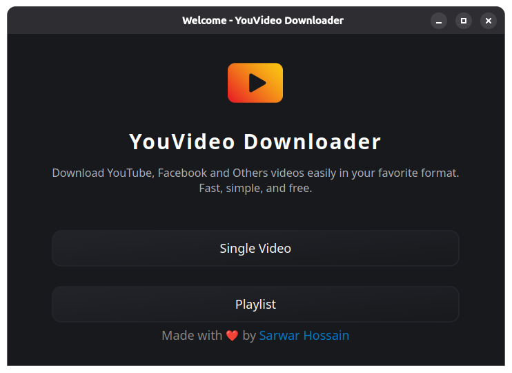
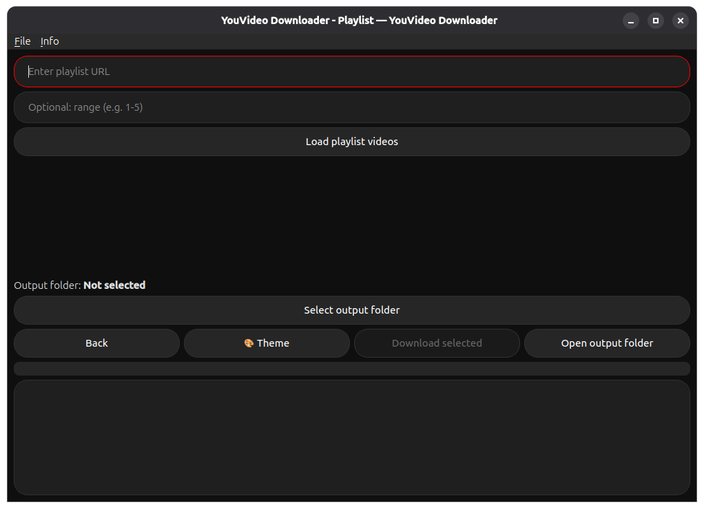
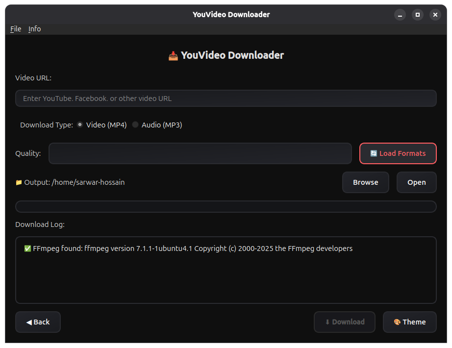

# YouVideo Downloader

## Features

- Download YouTube, Facebook, and other videos by specifying the URL.
- Detects if _ffmpeg_ is installed; if not, offers automatic installation for any OS.
- Choose from multiple available video/audio formats.
- Load Playlist using range & and download best quality 
- Add Option to download mp3
- Select output folder to save downloads.
- Real-time progress bar showing download and conversion progress.
- Log window displaying download status and messages.
- Switch between dark and light themes inspired by YouTube.
- Handles downloading and merging audio/video formats automatically.
- Built with Pyside6 for a sleek desktop experience.
- Modern neumorphism-inspired UI with separate QSS files for each theme and dialog.
- Welcome screen before main window for a friendly start.

---

## What's New in v3.0.0 (English)

- System-level dependency updater for FFmpeg and yt-dlp (Windows, Linux, macOS).
- Theme switching is smoother and synced across all windows.
- Developer Info dialog now follows the current theme.
- App starts with the original dark theme when system theme is unknown.

---

## নতুন কী (v3.0.0) — বাংলা

- FFmpeg ও yt-dlp এর জন্য সিস্টেম-লেভেল ডিপেনডেন্সি আপডেটার (Windows, Linux, macOS)।
- থিম পরিবর্তন আরও স্মুথ এবং সব উইন্ডোতে সিঙ্ক হয়।
- Developer Info ডায়ালগ এখন বর্তমান থিম অনুসরণ করে।
- সিস্টেম থিম অনির্ধারিত হলে অ্যাপ ডিফল্টভাবে মূল ডার্ক থিমে শুরু হয়।

---

## Project Overview

The "YouVideo Downloader" is a desktop application built with Python and PySide6, designed to facilitate the downloading of videos from various platforms like YouTube and Facebook. It emphasizes a user-friendly experience with a modern, neumorphism-inspired UI and robust video processing capabilities.

**Key Components and Architecture:**

*   **`main.py`**: The application's entry point, responsible for initializing the PySide6 application and displaying the welcome screen or main window.
*   **`ui/`**: Contains all user interface components.
    *   `main_window.py`: Implements the core functionality and layout of the main application window.
    *   `playlist_window.py`: Handles the UI specific to playlist downloading.
    *   `welcome_screen.py`: Displays an initial welcome screen to the user.
    *   `themes.py`: Manages the application's theming (dark/light), often using QSS files for styling.
*   **`downloader/`**: Encapsulates the video downloading and processing logic.
    *   `yt_downloader.py`: Integrates with `yt-dlp` to handle video fetching, format selection, and download management.
    *   `ffmpeg_utils.py`: Provides utilities for `ffmpeg` integration, including detection, installation, and video/audio merging operations.
*   **`utils/`**: Contains general utility functions.
    *   `pathfinder.py`: Likely deals with locating system paths or external executables (like `ffmpeg`).
*   **`assets/`**: Stores static assets such as icons, QSS (Qt Style Sheets) for theming, and screenshots for documentation.
*   **Build System**: The project includes a comprehensive set of shell scripts (`build.sh`, `install_dependencies.sh`, `build_deb.sh`, `build_appimage.sh`) to automate the packaging of the application into deployable formats like DEB packages and AppImages for Linux, and uses PyInstaller for creating executables for other operating systems (inferred from `setup3.0.0.iss` and `youvideo-downloader.spec`).

The application architecture promotes separation of concerns, with distinct modules for UI, core downloading logic, and utilities, making it maintainable and extensible. The use of QSS files allows for flexible and easily customizable themes.

---

## Installation

### Requirements

- Python 3.8 or higher
- `yt-dlp` (YouTube downloader backend)
- Pyside6
- ffmpeg

### Steps

1. Clone or download the repository.

```bash
git clone https://github.com/Sarwarhridoy4/youvideo-downloader.git
cd youvideo-downloader
```

2. Create and activate a Python virtual environment (optional but recommended):

```bash
python -m venv venv
source venv/bin/activate  # Linux/macOS
venv\Scripts\activate   # Windows
```

3. Install required Python packages:

```bash
pip install -r requirements.txt
```

4. Install **ffmpeg**:

#### Windows

- Download the latest static build from [ffmpeg.org/download.html](https://ffmpeg.org/download.html).
- Extract the zip file.
- Add the `bin` folder (inside the extracted folder) to your system `PATH`.

#### Windows (Alternative: Using winget)

- If you have [winget](https://learn.microsoft.com/en-us/windows/package-manager/winget/) installed, you can install ffmpeg with:

```bash
winget install --id=Gyan.FFmpeg -e
```

#### Linux

- Install via package manager (example for Ubuntu/Debian):

```bash
sudo apt update
sudo apt install ffmpeg
```

#### macOS

- Install using [Homebrew](https://brew.sh/):

```bash
brew install ffmpeg
```

5. Run the application:

```bash
python main.py
```

---

## বৈশিষ্ট্যসমূহ

- ইউটিউব ভিডিও ডাউনলোড করার সুবিধা।
- ফেসবুকসহ অন্যান্য প্ল্যাটফর্ম থেকেও ভিডিও ডাউনলোড করার সুবিধা (ইউটিউব ও ফেসবুক পরীক্ষিত)।
- _ffmpeg_ ইনস্টল আছে কিনা স্বয়ংক্রিয়ভাবে শনাক্ত করে এবং না থাকলে যেকোনো অপারেটিং সিস্টেমে স্বয়ংক্রিয়ভাবে ইনস্টল করার ব্যবস্থা।
- বিভিন্ন ভিডিও/অডিও ফরম্যাট থেকে পছন্দ করার অপশন।
- mp3 ডাউনলোড করার অপশন।
- ডাউনলোড সংরক্ষণের জন্য ফোল্ডার নির্বাচন।
- ডাউনলোড এবং কনভার্সনের অগ্রগতি দেখানো প্রগ্রেস বার।
- ডাউনলোড স্ট্যাটাস এবং মেসেজ দেখানোর লগ উইন্ডো।
- ইউটিউব অনুপ্রাণিত ডার্ক ও লাইট থিম পরিবর্তন করার সুবিধা।
- অডিও ও ভিডিও ফরম্যাট স্বয়ংক্রিয়ভাবে ডাউনলোড ও মার্জ করার ব্যবস্থা।
- Pyside6 ব্যবহার করে একটি আধুনিক ডেস্কটপ অ্যাপ্লিকেশন।
- আলাদা QSS ফাইলসহ আধুনিক নিউমরফিজম অনুপ্রাণিত UI প্রতিটি থিম এবং ডায়ালগের জন্য।
- প্রধান উইন্ডোর আগে স্বাগতম স্ক্রীন, বন্ধুত্বপূর্ণ শুরু করার জন্য।

---

## ইনস্টলেশন

### প্রয়োজনীয়তা

- Python 3.8 বা তার উপরে
- `yt-dlp` (ইউটিউব ডাউনলোডার ব্যাকএন্ড)
- Pyside6
- ffmpeg

### ধাপসমূহ

1. রিপোজিটরি ক্লোন অথবা ডাউনলোড করুন।

```bash
git clone https://github.com/Sarwarhridoy4/youvideo-downloader.git
cd youvideo-downloader
```

2. পাইটনের ভার্চুয়াল এনভায়রনমেন্ট তৈরি ও সক্রিয় করুন (ঐচ্ছিক):

```bash
python -m venv venv
source venv/bin/activate  # Linux/macOS
venv\Scripts\activate   # Windows
```

3. প্রয়োজনীয় প্যাকেজ ইনস্টল করুন:

```bash
pip install -r requirements.txt
```

4. **ffmpeg** ইনস্টল করুন:

#### Windows

- [ffmpeg.org/download.html](https://ffmpeg.org/download.html) থেকে সর্বশেষ স্ট্যাটিক বিল্ড ডাউনলোড করুন।
- জিপ ফাইলটি এক্সট্রাক্ট করুন।
- এক্সট্রাক্ট করা ফোল্ডারের ভিতরের `bin` ফোল্ডারটি আপনার সিস্টেম `PATH`-এ যোগ করুন।

#### Windows (বিকল্প: winget ব্যবহার করে)

- যদি আপনার [winget](https://learn.microsoft.com/en-us/windows/package-manager/winget/) ইনস্টল করা থাকে, তাহলে নিচের কমান্ড দিয়ে ffmpeg ইনস্টল করতে পারেন:

```bash
winget install --id=Gyan.FFmpeg -e
```

#### Linux

- প্যাকেজ ম্যানেজার দিয়ে ইনস্টল করুন (উদাহরণ: Ubuntu/Debian):

```bash
sudo apt update
sudo apt install ffmpeg
```

#### macOS

- [Homebrew](https://brew.sh/) ব্যবহার করে ইনস্টল করুন:

```bash
brew install ffmpeg
```

5. অ্যাপ্লিকেশন চালান:

```bash
python main.py
```

---

## Screenshot Welcome



## Screenshot Playlist



## Screenshot Single



---

## 🚀 Building Packages

YouVideo Downloader provides comprehensive build scripts for creating DEB packages and AppImages on Linux.

### Quick Start - Build Packages

#### Method 1: Using Master Build Script (Easiest)

```bash
# Make the master script executable
chmod +x build.sh

# Run interactive menu
./build.sh

# Or use direct commands:
./build.sh deps        # Install all dependencies
./build.sh deb         # Build DEB package
./build.sh appimage    # Build AppImage
./build.sh all         # Build both packages
```

#### Method 2: Install Dependencies First

```bash
# Install all required dependencies (FFmpeg, Qt6, PySide6, etc.)
chmod +x install_dependencies.sh
sudo ./install_dependencies.sh

# Then build your package
chmod +x build_deb.sh        # For DEB package
./build_deb.sh

# OR
chmod +x build_appimage.sh   # For AppImage
./build_appimage.sh
```

### Available Build Scripts

1. **`build.sh`** - Master build script with interactive menu
2. **`install_dependencies.sh`** - Automated dependency installer for all Linux distributions
3. **`build_deb.sh`** - Creates `.deb` packages for Debian-based systems
4. **`build_appimage.sh`** - Creates portable AppImages for universal Linux compatibility

### What Gets Installed

The dependency installer handles:
- ✅ Python 3.8+ and pip
- ✅ FFmpeg (video/audio processing)
- ✅ Qt6 libraries (PySide6 dependencies)
- ✅ X11 and graphics libraries
- ✅ Audio libraries
- ✅ Build tools and packaging utilities
- ✅ PyInstaller, PySide6, yt-dlp

### Supported Linux Distributions

- Ubuntu / Debian / Linux Mint / Pop!_OS
- Fedora / RHEL / CentOS / Rocky Linux
- Arch Linux / Manjaro / EndeavourOS
- openSUSE / SLES

### Build Output

**DEB Package:**
- File: `youvideo-downloader_1.6.0_amd64.deb`
- Install: `sudo dpkg -i youvideo-downloader_1.6.0_amd64.deb`
- Run: `youvideo-downloader`

**AppImage:**
- File: `YouVideo_Downloader-x86_64.AppImage`
- Make executable: `chmod +x YouVideo_Downloader-x86_64.AppImage`
- Run: `./YouVideo_Downloader-x86_64.AppImage`

### Documentation

For detailed build instructions, troubleshooting, and customization:
- **[BUILD_GUIDE.md](BUILD_GUIDE.md)** - Complete step-by-step build guide
- **[QUICK_REFERENCE.md](QUICK_REFERENCE.md)** - Command cheat sheet
- **[BUILD_SCRIPTS_README.md](BUILD_SCRIPTS_README.md)** - Technical documentation

---

## Contributing

Contributions are welcome! To contribute:

1. Fork the repository and create your branch from `main`.
2. Make your changes with clear, descriptive commit messages.
3. Test your changes to ensure stability.
4. Submit a pull request describing your changes and the motivation behind them.

For bug reports or feature requests, please open an issue with detailed information.

Thank you for helping improve YouVideo Downloader!

---

## Project Folder Structure

The following is the main folder structure of the **YouVideo Downloader** project:

```
youvideo-downloader/
│
├── assets/                      # Icons, styles, screenshots
│   ├── icons/
│   ├── qss/
│   └── screenshot/
│
├── downloader/                  # Core logic
│   ├── ffmpeg_utils.py
│   └── yt_downloader.py
│
├── ui/                          # PySide6 UI components
│   ├── main_window.py
│   ├── playlist_window.py
│   ├── welcome_screen.py
│   └── themes.py
│
├── main.py                      # App entry point
├── requirements.txt             # Python dependencies
│
├── build.sh                     # Master build script
├── install_dependencies.sh      # Dependency installer
├── build_deb.sh                 # DEB package builder
├── build_appimage.sh            # AppImage builder
│
├── BUILD_GUIDE.md              # Complete build documentation
├── QUICK_REFERENCE.md          # Command cheat sheet
├── BUILD_SCRIPTS_README.md     # Technical documentation
│
├── LICENSE
├── .gitignore
└── README.md
```

---

## 📽️ Watch the Demo Video

[](https://drive.google.com/file/d/1MfvxdM8NGUY02P9VjrEMSlkNO7JptZsE/preview)

---

## 🖥️ Download & Install

### Windows

**Windows users can download the latest version here:**

<p align="center">
  <a href="https://github.com/Sarwarhridoy4/youvideo-downloader/releases/download/1.6.0/YouVideo_Downloader_setup.exe">
    
  </a>
</p>

1. Click the link above to download the installer.
2. Run the installer and follow the setup instructions.
3. Launch the application and start downloading!

### Linux

**AppImage (Universal - Works on all distributions)**

<p align="center">
  <a href="https://github.com/Sarwarhridoy4/youvideo-downloader/releases/download/1.6.0/YouVideo_Downloader-x86_64.AppImage">
    
  </a>
</p>

```bash
# Download and run
chmod +x YouVideo_Downloader-x86_64.AppImage
./YouVideo_Downloader-x86_64.AppImage
```

**DEB Package (Debian/Ubuntu/Mint)**

<p align="center">
  <a href="https://github.com/Sarwarhridoy4/youvideo-downloader/releases/download/1.6.0/youvideo-downloader_1.6.0_amd64.deb">
    
  </a>
</p>

```bash
# Install
sudo dpkg -i youvideo-downloader_1.6.0_amd64.deb
sudo apt --fix-broken install  # Fix any dependency issues

# Run
youvideo-downloader
```

### Build From Source

Want to build packages yourself? See the [🚀 Building Packages](#-building-packages) section above.

---

## 🔍 Issues & Known Limitations

- ✅ ffmpeg auto install not working as expected in Linux/macOS (in compiled version only) - **Resolved**
  - Solution: Install manually using package manager (commands provided in README)
  - Build scripts now handle this automatically

---

## ⚙️ Requirements (Pre-built Packages)

Pre-built installers include everything you need:

- Python runtime
- Embedded FFmpeg binary
- Pre-packaged `yt-dlp`
- All dependencies bundled

**For building from source:** See [BUILD_GUIDE.md](BUILD_GUIDE.md) for complete dependency list.

---

## 📤 Feedback & Issues

If you encounter bugs or want to suggest features, please [open an issue](https://github.com/Sarwarhridoy4/youvideo-downloader/issues).

---

## License

This project is licensed under the MIT License. See the [LICENSE](LICENSE) file for details.

---

## 📚 Additional Documentation

- **[BUILD_GUIDE.md](BUILD_GUIDE.md)** - Complete guide for building DEB and AppImage packages
- **[QUICK_REFERENCE.md](QUICK_REFERENCE.md)** - Quick command reference and troubleshooting
- **[BUILD_SCRIPTS_README.md](BUILD_SCRIPTS_README.md)** - Technical documentation for build scripts
- **[compile_guide.md](compile_guide.md)** - Original compilation guide

---

<p align="center">
  Made with ❤️ by <a href="https://github.com/Sarwarhridoy4">Sarwar Hossain</a>
</p>

<p align="center">
  <a href="https://github.com/Sarwarhridoy4/youvideo-downloader/stargazers">
    
  </a>
  <a href="https://github.com/Sarwarhridoy4/youvideo-downloader/network/members">
    
  </a>
  <a href="https://github.com/Sarwarhridoy4/youvideo-downloader/issues">
    
  </a>
  <a href="https://github.com/Sarwarhridoy4/youvideo-downloader/blob/production/LICENSE">
    
  </a>
</p>
