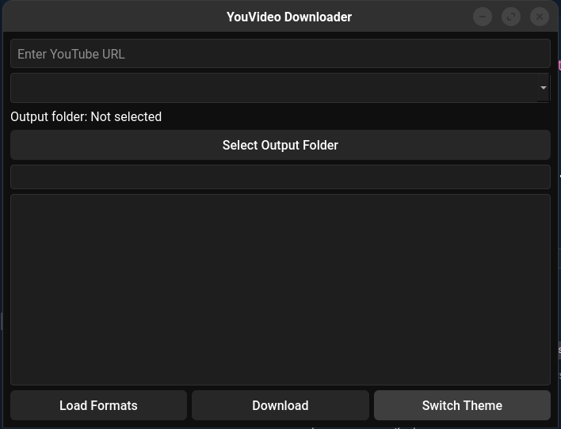
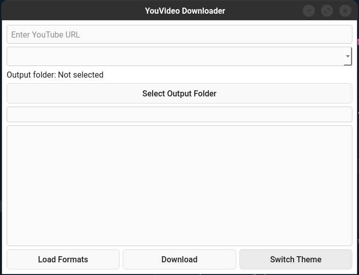

# YouVideo Downloader

## Features

- Download YouTube videos by specifying the URL.
- Support Facebook and maybe others platform Also.(Youtube and Facebook Tested)
- Make it detect ffmpeg and install automatic if not installed already regardless of OS platform
- Choose from multiple available video/audio formats.
- Select output folder to save downloads.
- Real-time progress bar showing download and conversion progress.
- Log window displaying download status and messages.
- Switch between dark and light themes inspired by YouTube.
- Handles downloading and merging audio/video formats automatically.
- Built with PyQt6 for a sleek desktop experience.

---

## Installation

### Requirements

- Python 3.8 or higher
- `yt-dlp` (YouTube downloader backend)
- PyQt6
- ffmpeg

### Steps

1. Clone or download the repository.

```bash
git clone https://github.com/Sarwarhridoy4/youvideo-downloader.git
cd youvideo-downloader
```

2. Create and activate a Python virtual environment (optional but recommended):

```bash
python -m venv venv
source venv/bin/activate  # Linux/macOS
venv\Scripts\activate   # Windows
```

3. Install required Python packages:

```bash
pip install -r requirements.txt
```

4. Install **ffmpeg**:

#### Windows

- Download the latest static build from [ffmpeg.org/download.html](https://ffmpeg.org/download.html).
- Extract the zip file.
- Add the `bin` folder (inside the extracted folder) to your system `PATH`.

#### Windows (Alternative: Using winget)

- If you have [winget](https://learn.microsoft.com/en-us/windows/package-manager/winget/) installed, you can install ffmpeg with:

```bash
winget install --id=Gyan.FFmpeg -e
```

#### Linux

- Install via package manager (example for Ubuntu/Debian):

```bash
sudo apt update
sudo apt install ffmpeg
```

#### macOS

- Install using [Homebrew](https://brew.sh/):

```bash
brew install ffmpeg
```

5. Run the application:

```bash
python main.py
```

---

## বৈশিষ্ট্যসমূহ

- ইউটিউব ভিডিও ডাউনলোড করার সুবিধা।
- ফেসবুকসহ অন্যান্য প্ল্যাটফর্ম থেকেও ভিডিও ডাউনলোড করার সুবিধা (ইউটিউব ও ফেসবুক পরীক্ষিত)।
- ffmpeg ইনস্টল আছে কিনা স্বয়ংক্রিয়ভাবে শনাক্ত করে এবং না থাকলে যেকোনো অপারেটিং সিস্টেমে স্বয়ংক্রিয়ভাবে ইনস্টল করার ব্যবস্থা।
- বিভিন্ন ভিডিও/অডিও ফরম্যাট থেকে পছন্দ করার অপশন।
- ডাউনলোড সংরক্ষণের জন্য ফোল্ডার নির্বাচন।
- ডাউনলোড এবং কনভার্সনের অগ্রগতি দেখানো প্রগ্রেস বার।
- ডাউনলোড স্ট্যাটাস এবং মেসেজ দেখানোর লগ উইন্ডো।
- ইউটিউব অনুপ্রাণিত ডার্ক ও লাইট থিম পরিবর্তন করার সুবিধা।
- অডিও ও ভিডিও ফরম্যাট স্বয়ংক্রিয়ভাবে ডাউনলোড ও মার্জ করার ব্যবস্থা।
- PyQt6 ব্যবহার করে একটি আধুনিক ডেস্কটপ অ্যাপ্লিকেশন।

---

## ইনস্টলেশন

### প্রয়োজনীয়তা

- Python 3.8 বা তার উপরে
- `yt-dlp` (ইউটিউব ডাউনলোডার ব্যাকএন্ড)
- PyQt6

### ধাপসমূহ

1. রিপোজিটরি ক্লোন অথবা ডাউনলোড করুন।

```bash
git clone https://github.com/yourusername/youvideo-downloader.git
cd youvideo-downloader
```

2. পাইটনের ভার্চুয়াল এনভায়রনমেন্ট তৈরি ও সক্রিয় করুন (ঐচ্ছিক):

```bash
python -m venv venv
source venv/bin/activate  # Linux/macOS
venv\Scripts\activate   # Windows
```

3. প্রয়োজনীয় প্যাকেজ ইনস্টল করুন:

```bash
pip install -r requirements.txt
```

4. **ffmpeg** ইনস্টল করুন:

#### Windows

- [ffmpeg.org/download.html](https://ffmpeg.org/download.html) থেকে সর্বশেষ স্ট্যাটিক বিল্ড ডাউনলোড করুন।
- জিপ ফাইলটি এক্সট্রাক্ট করুন।
- এক্সট্রাক্ট করা ফোল্ডারের ভিতরের `bin` ফোল্ডারটি আপনার সিস্টেম `PATH`-এ যোগ করুন।

#### Windows (বিকল্প: winget ব্যবহার করে)

- যদি আপনার [winget](https://learn.microsoft.com/en-us/windows/package-manager/winget/) ইনস্টল করা থাকে, তাহলে নিচের কমান্ড দিয়ে ffmpeg ইনস্টল করতে পারেন:

```bash
winget install --id=Gyan.FFmpeg -e
```

#### Linux

- প্যাকেজ ম্যানেজার দিয়ে ইনস্টল করুন (উদাহরণ: Ubuntu/Debian):

```bash
sudo apt update
sudo apt install ffmpeg
```

#### macOS

- [Homebrew](https://brew.sh/) ব্যবহার করে ইনস্টল করুন:

```bash
brew install ffmpeg
```

5. অ্যাপ্লিকেশন চালান:

```bash
python main.py
```

---

## Screenshot(Dark) Default



## Screenshot(Light)



## Contributing

Contributions are welcome! To contribute:

1. Fork the repository and create your branch from `main`.
2. Make your changes with clear, descriptive commit messages.
3. Test your changes to ensure stability.
4. Submit a pull request describing your changes and the motivation behind them.

For bug reports or feature requests, please open an issue with detailed information.

Thank you for helping improve YouVideo Downloader!

---

## License

This project is licensed under the MIT License. See the [LICENSE](LICENSE) file for details.

Made with ❤️ by Sarwar Hossain
