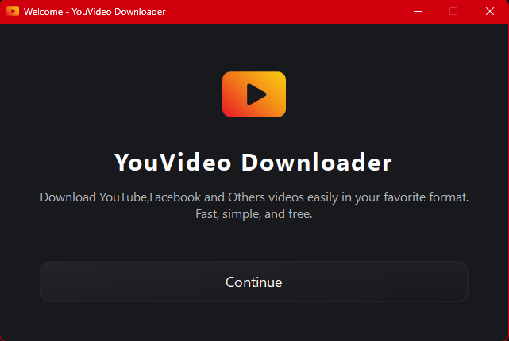
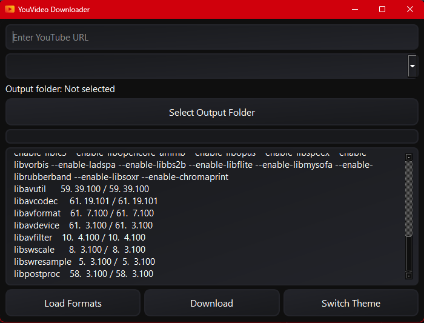
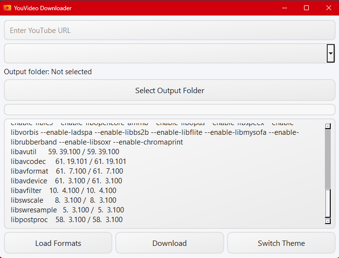

# YouVideo Downloader

## Features

- Download YouTube, Facebook, and other videos by specifying the URL.
- Detects if _ffmpeg_ is installed; if not, offers automatic installation for any OS.
- Choose from multiple available video/audio formats.
- Select output folder to save downloads.
- Real-time progress bar showing download and conversion progress.
- Log window displaying download status and messages.
- Switch between dark and light themes inspired by YouTube.
- Handles downloading and merging audio/video formats automatically.
- Built with PyQt6 for a sleek desktop experience.
- Modern neumorphism-inspired UI with separate QSS files for each theme and dialog.
- Welcome screen before main window for a friendly start.

---

## Installation

### Requirements

- Python 3.8 or higher
- `yt-dlp` (YouTube downloader backend)
- PyQt6
- ffmpeg

### Steps

1. Clone or download the repository.

```bash
git clone https://github.com/Sarwarhridoy4/youvideo-downloader.git
cd youvideo-downloader
```

2. Create and activate a Python virtual environment (optional but recommended):

```bash
python -m venv venv
source venv/bin/activate  # Linux/macOS
venv\Scripts\activate   # Windows
```

3. Install required Python packages:

```bash
pip install -r requirements.txt
```

4. Install **ffmpeg**:

#### Windows

- Download the latest static build from [ffmpeg.org/download.html](https://ffmpeg.org/download.html).
- Extract the zip file.
- Add the `bin` folder (inside the extracted folder) to your system `PATH`.

#### Windows (Alternative: Using winget)

- If you have [winget](https://learn.microsoft.com/en-us/windows/package-manager/winget/) installed, you can install ffmpeg with:

```bash
winget install --id=Gyan.FFmpeg -e
```

#### Linux

- Install via package manager (example for Ubuntu/Debian):

```bash
sudo apt update
sudo apt install ffmpeg
```

#### macOS

- Install using [Homebrew](https://brew.sh/):

```bash
brew install ffmpeg
```

5. Run the application:

```bash
python main.py
```

---

## বৈশিষ্ট্যসমূহ

- ইউটিউব ভিডিও ডাউনলোড করার সুবিধা。
- ফেসবুকসহ অন্যান্য প্ল্যাটফর্ম থেকেও ভিডিও ডাউনলোড করার সুবিধা (ইউটিউব ও ফেসবুক পরীক্ষিত)。
- _ffmpeg_ ইনস্টল আছে কিনা স্বয়ংক্রিয়ভাবে শনাক্ত করে এবং না থাকলে যেকোনো অপারেটিং সিস্টেমে স্বয়ংক্রিয়ভাবে ইনস্টল করার ব্যবস্থা。
- বিভিন্ন ভিডিও/অডিও ফরম্যাট থেকে পছন্দ করার অপশন。
- ডাউনলোড সংরক্ষণের জন্য ফোল্ডার নির্বাচন。
- ডাউনলোড এবং কনভার্সনের অগ্রগতি দেখানো প্রগ্রেস বার。
- ডাউনলোড স্ট্যাটাস এবং মেসেজ দেখানোর লগ উইন্ডো。
- ইউটিউব অনুপ্রাণিত ডার্ক ও লাইট থিম পরিবর্তন করার সুবিধা。
- অডিও ও ভিডিও ফরম্যাট স্বয়ংক্রিয়ভাবে ডাউনলোড ও মার্জ করার ব্যবস্থা。
- PyQt6 ব্যবহার করে একটি আধুনিক ডেস্কটপ অ্যাপ্লিকেশন。
- আলাদা QSS ফাইলসহ আধুনিক নিউমরফিজম অনুপ্রাণিত UI প্রতিটি থিম এবং ডায়ালগের জন্য。
- প্রধান উইন্ডোর আগে স্বাগতম স্ক্রীন, বন্ধুত্বপূর্ণ শুরু করার জন্য।

---

## ইনস্টলেশন

### প্রয়োজনীয়তা

- Python 3.8 বা তার উপরে
- `yt-dlp` (ইউটিউব ডাউনলোডার ব্যাকএন্ড)
- PyQt6
- ffmpeg

### ধাপসমূহ

1. রিপোজিটরি ক্লোন অথবা ডাউনলোড করুন।

```bash
git clone https://github.com/yourusername/youvideo-downloader.git
cd youvideo-downloader
```

2. পাইটনের ভার্চুয়াল এনভায়রনমেন্ট তৈরি ও সক্রিয় করুন (ঐচ্ছিক):

```bash
python -m venv venv
source venv/bin/activate  # Linux/macOS
venv\Scripts\activate   # Windows
```

3. প্রয়োজনীয় প্যাকেজ ইনস্টল করুন:

```bash
pip install -r requirements.txt
```

4. **ffmpeg** ইনস্টল করুন:

#### Windows

- [ffmpeg.org/download.html](https://ffmpeg.org/download.html) থেকে সর্বশেষ স্ট্যাটিক বিল্ড ডাউনলোড করুন。
- জিপ ফাইলটি এক্সট্রাক্ট করুন。
- এক্সট্রাক্ট করা ফোল্ডারের ভিতরের `bin` ফোল্ডারটি আপনার সিস্টেম `PATH`-এ যোগ করুন।

#### Windows (বিকল্প: winget ব্যবহার করে)

- যদি আপনার [winget](https://learn.microsoft.com/en-us/windows/package-manager/winget/) ইনস্টল করা থাকে, তাহলে নিচের কমান্ড দিয়ে ffmpeg ইনস্টল করতে পারেন:

```bash
winget install --id=Gyan.FFmpeg -e
```

#### Linux

- প্যাকেজ ম্যানেজার দিয়ে ইনস্টল করুন (উদাহরণ: Ubuntu/Debian):

```bash
sudo apt update
sudo apt install ffmpeg
```

#### macOS

- [Homebrew](https://brew.sh/) ব্যবহার করে ইনস্টল করুন:

```bash
brew install ffmpeg
```

5. অ্যাপ্লিকেশন চালান:

```bash
python main.py
```

---

## Screenshot Welcome



## Screenshot(Dark) Default



## Screenshot(Light)



## Contributing

Contributions are welcome! To contribute:

1. Fork the repository and create your branch from `main`.
2. Make your changes with clear, descriptive commit messages.
3. Test your changes to ensure stability.
4. Submit a pull request describing your changes and the motivation behind them.

For bug reports or feature requests, please open an issue with detailed information.

Thank you for helping improve YouVideo Downloader!

---

## Project Folder Structure

The following is the main folder structure of the **YouVideo Downloader** project:

```
youvideo-downloader/
│
├── assets/                      # Contains assets like icons, QSS themes, screenshots, etc.
│   ├── icons/                   # Application icons (e.g., appicon.png, spinner.gif)
│   ├── qss/                     # Qt Style Sheets (dark.qss, light.qss, welcome.qss)
│   └── screenshot/              # Screenshots for documentation
│
├── downloader/                  # Core download logic and ffmpeg utilities
│   ├── __init__.py
│   ├── ffmpeg_utils.py
│   └── yt_downloader.py
│
├── ui/                          # User interface components
│   ├── __init__.py
│   ├── main_window.py
│   ├── themes.py
│   └── welcome_screen.py
│
├── main.py                      # Main application entry point
├── requirements.txt             # Python package dependencies
├── LICENSE                      # License file for the project
└── readme.md                    # This README file
```


---

## 🖥️ Download & Install

**Windows users can download the latest version here:**

<p align="center">
  <a href="https://github.com/Sarwarhridoy4/youvideo-downloader/releases/download/1.0/YouVideo_Downloader_setup.exe">
    
  </a>
</p>

**Linux users can download the latest version here:**

<p align="center">
  <a href="https://github.com/Sarwarhridoy4/youvideo-downloader/releases/download/1.0/YouVideoDownloader-x86_64.AppImage">
    
  </a>
</p>


1. Click the link above to download the installer.
2. Run the installer and follow the setup instructions.
3. Launch the application and start downloading!
4. Portable for linux AppImage 


## Issues

- ffmpeg auto install not working as expected in linux and maybe in mac due to not getting the super user privillage
- install manually in this case will works fine
- command are given in readme already

## ⚙️ Requirements (Built-in)

You don't need to install Python or FFmpeg separately. The installer includes:

- Python runtime
- Embedded FFmpeg binary
- Pre-packaged `yt-dlp`

---

## 📤 Feedback & Issues

If you encounter bugs or want to suggest features, please [open an issue](https://github.com/Sarwarhridoy4/youvideo-downloader/issues).

---


## License

This project is licensed under the MIT License. See the [LICENSE](LICENSE) file for details.

> For comlpile guide
[HOW TO COPMILE](compile_guide.md)

Made with ❤️ by Sarwar Hossain
